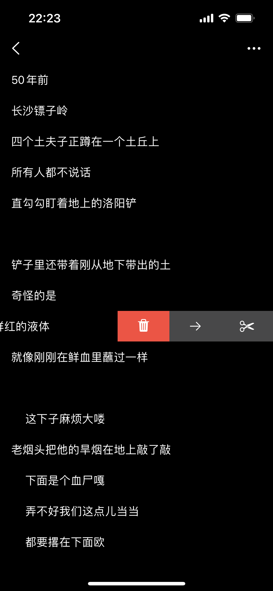
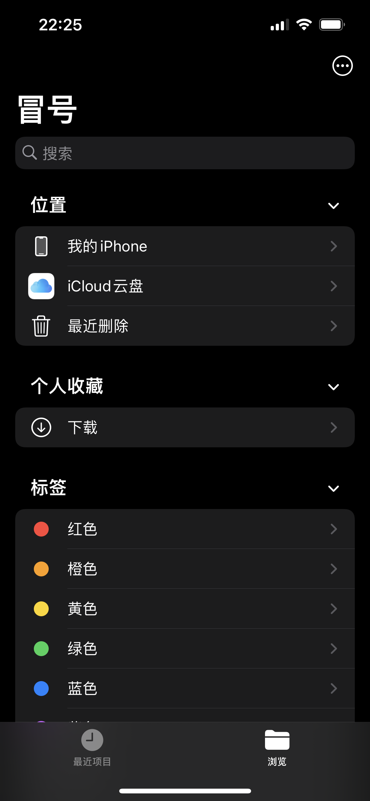
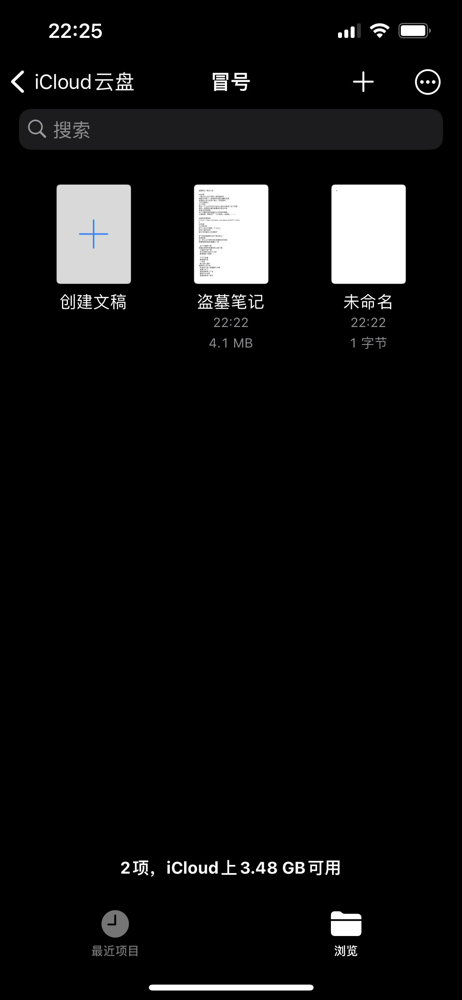

# 冒号网文编辑器

冒号是一款只支持语音输入的网文写作软件

# 软件截图

 |  | 
--- | --- | ---
 |  | 
 |  | 

# 您不应该购买的原因

* 只支持语音输入
* 使用了特殊的文本格式
* 不能输入标点
* 没有PC版
* 只有编辑类功能
* 纯单机（除了使用苹果公司的云盘同步及其语音识别外）

# 您应该购买的原因

上述原因

# 反馈

如果您有任何意见或建议，请随时发送邮件到[我的邮箱](mailto:pop2ones@icloud.com)
