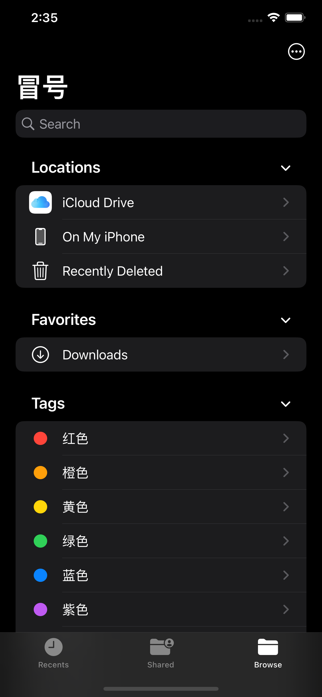

# 冒号网文编辑器

冒号是一款支持语音输入的网文写作软件

# 购买原因

帮您每天节省至少23分钟

* 键盘打字: 写一章小说需要2小时
* 传统语音识别软件：录一章小说需要30分钟，修改格式需要20分钟，修改识别错误的词语需要20分钟，共70分钟
* 冒号编辑器：录一章小说需要30分钟，修改格式需要5分钟，修改识别错误词语需要12分钟，共47分钟

# 软件截图

 |  | 
--- | --- | ---
 |  |

# 特色功能

* 平铺的TXT显示方式更容易在移动端修改
* 语音识别后的文本会自动进行分段，区分对白，添加标点
* 可使用iCloud云盘保护数据安全
* 无需网络权限，开发者无法获取您的数据（iCloud云盘和语音识别会连接苹果公司网络）
* 可导入第三方语音识别文本

# 反馈

如果您有任何意见或建议，请随时发送邮件到[我的邮箱](mailto:pop2ones@icloud.com?subject=冒号编辑器反馈)
